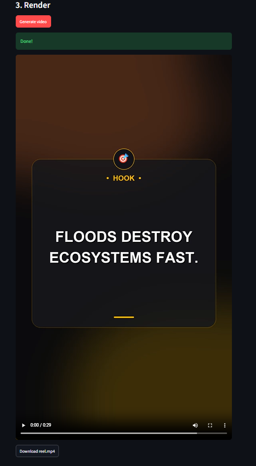
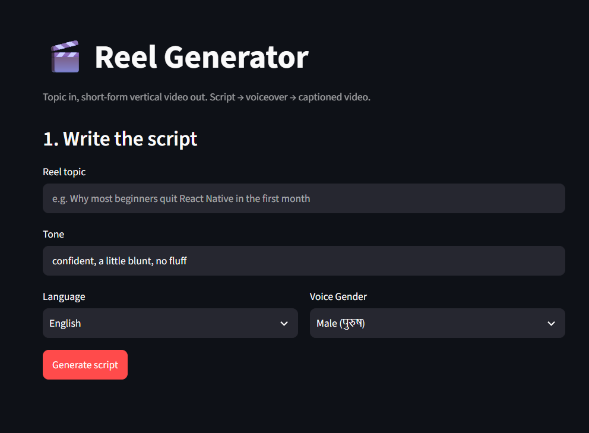
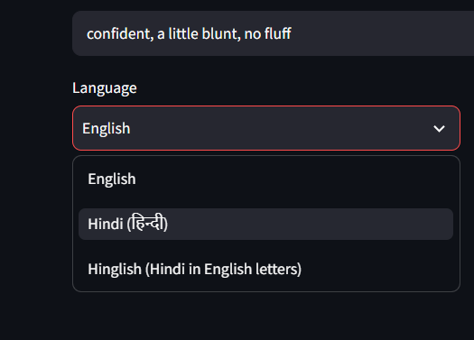
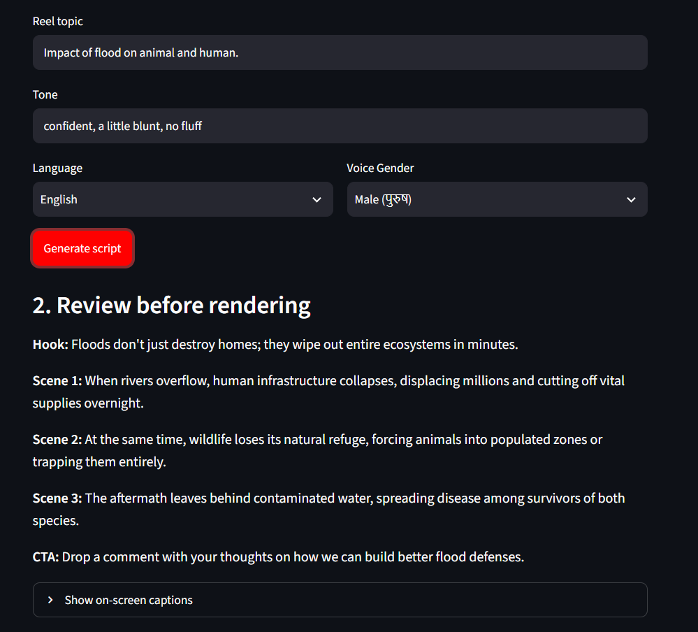

# 🎬 Reel Generator

**A topic goes in. A finished, captioned, vertical (1080×1920) reel comes out.**

Script writing, multi-language localization, studio-grade neural voiceover, sound design, and video assembly — all automated. Built to actually produce high-retention reels for my **Innera** YouTube channel, not as a portfolio-only demo.


<p align="center">
  
</p>

---

## 🚀 Why I Built This

I already edit video for Innera, and the slow part was never the editing — it was staring at a blank page trying to write a hook that doesn't sound like every other generic reel.

I wanted something that produces a solid **first draft** — script + localized voiceover + SFX + captioned rough cut — in under two minutes, which I can then review, tweak, and hand off to an editor, instead of starting from zero every single time.

> It replaces the blank-page problem, not the whole editing process.

---

## 🔄 Pipeline

```
Topic + Language + Voice Gender
            │
            ▼
┌───────────────────────┐
│  write_script          │  → Generates spoken hook, body scenes, CTA
│  (LangGraph)            │
└───────────┬────────────┘
            ▼
┌───────────────────────┐
│  add_captions           │  → Condenses each line into 2–4 word punchy captions
│  (LangGraph)            │
└───────────┬────────────┘
            ▼
┌───────────────────────┐
│  TTS Audio Engine       │  → edge-tts synthesizes voiceover & measures exact durations
└───────────┬────────────┘
            ▼
┌───────────────────────┐
│  Pillow Engine          │  → Renders Glassmorphism frames w/ Devanagari & Latin fonts
└───────────┬────────────┘
            ▼
┌───────────────────────┐
│  MoviePy Compositor     │  → Stitches frames + voiceover + BGM + SFX → reel.mp4
└───────────────────────┘
```

---

## ✨ Features

| Feature | Details |
|---|---|
| 🌐 **Multi-Language Support** | Scripts & captions in **English**, **Hindi (हिन्दी)** with native Devanagari rendering, or **Hinglish** (Hindi in Latin text) |
| 🎙️ **Male & Female Neural Voices** | Studio voices via `edge-tts` (`hi-IN-MadhurNeural`, `hi-IN-SwaraNeural`, `en-US-AndrewMultilingualNeural`, `en-US-AvaMultilingualNeural`) with Reels-optimized pacing (`+10%` to `+12%`) |
| 🪟 **Glassmorphism UI** | Centered dark frosted-glass card, ambient dual aurora glow, floating contextual 3D emoji pill, intelligent keyword highlighting |
| 🔊 **Full Sound Design** | Dynamic transition whoosh SFX on scene changes + looped ambient BGM |
| 🔁 **Two-Step Review UI** | Streamlit interface lets you review and tweak the generated script before burning time on video rendering |

<p align="center">
  
  
  
</p>
<p align="center"><em>Enter a topic → generate the script → review hook, scenes & CTA before rendering</em></p>

---

## 🧠 Design Decisions

### Why two separate LLM passes for the script?

Narration and on-screen captions are two completely different jobs. What sounds natural spoken aloud ("so here's the thing most people get wrong about React Native performance...") is way too long to burn onto a mobile screen as text.

A single prompt trying to write both at once kept producing either good narration with clunky captions, or punchy captions paired with narration that read like a tweet.

Splitting it into `write_script` (spoken narration) → `add_captions` (2-4 word visual punch) fixed that. See `graph.py`.

### Why scene duration comes from real audio, not word-count math

Word-count estimates (`words / 150wpm`) don't hold up in practice — punctuation pauses, accents, language variation (Devanagari vs. English), and the TTS engine's own pacing all throw the math off.

Every line's voiceover is generated **first**, and its actual measured duration is what each video frame holds for. That's the only way captions stay in 100% sync with the voice. See `tts.py`.

---

## 🎨 Visual Style

Same palette as my portfolio:

| Color | Hex |
|---|---|
| Copper | `#F0733C` |
| Gold | `#FFC300` |
| Near-black | `#0A0A0C` |

Same two-glow aurora background effect. Uses `Space Grotesk Bold` for English text, with native OS font fallbacks (`Nirmala UI`, `Mangal`) for crisp Hindi Devanagari rendering.

---

## 🛠️ Stack

- **LangGraph** — 2-node state pipeline: `write_script` → `add_captions`
- **Google Gemini** (`gemini-2.5-flash`) — Structured output LLM for script & captions
- **edge-tts** — Free neural TTS, no API key, no quota limits
- **Pillow (PIL)** — Renders glassmorphism frames, typography, and badges
- **MoviePy & NumPy** — Stitches frames, voiceover, SFX, and BGM into the final MP4
- **Streamlit** — Interactive frontend for topic input, language/gender toggles, and review

---

## ⚙️ Setup & Installation

```bash
# 1. Clone the repository & install dependencies
git clone https://github.com/your-username/Reel_Generator.git
cd Reel_Generator
pip install -r requirements.txt

# 2. Configure environment variables
cp .env.example .env
# Add your Gemini API key inside .env:
# GOOGLE_API_KEY=your_gemini_api_key_here

# 3. Optional assets setup
# Drop a custom font into assets/SpaceGrotesk-Bold.ttf
# Drop custom BGM tracks into assets/bgm/*.mp3

# 4. Run the Streamlit app
streamlit run app.py
```

Or run it headless for a single reel via CLI:

```bash
python pipeline.py
```

---

## 📌 Real-Life Use

This is the first-draft generator for my Innera shorts — topic in, rough cut out, then I trim/adjust in an actual editor before posting. It replaces the blank-page problem, not the whole editing process.

---

## 🗺️ Roadmap

- [x] Multi-language script generation (English, Hindi, Hinglish)
- [x] Male / Female voice selector with Indian neural models
- [x] Background music (BGM) integration & transition SFX
- [x] Glassmorphism UI card styling
- [ ] Word-by-word kinetic typography animation
- [ ] Automated image/b-roll background generator per scene
- [ ] Batch processing mode via CSV topic input
